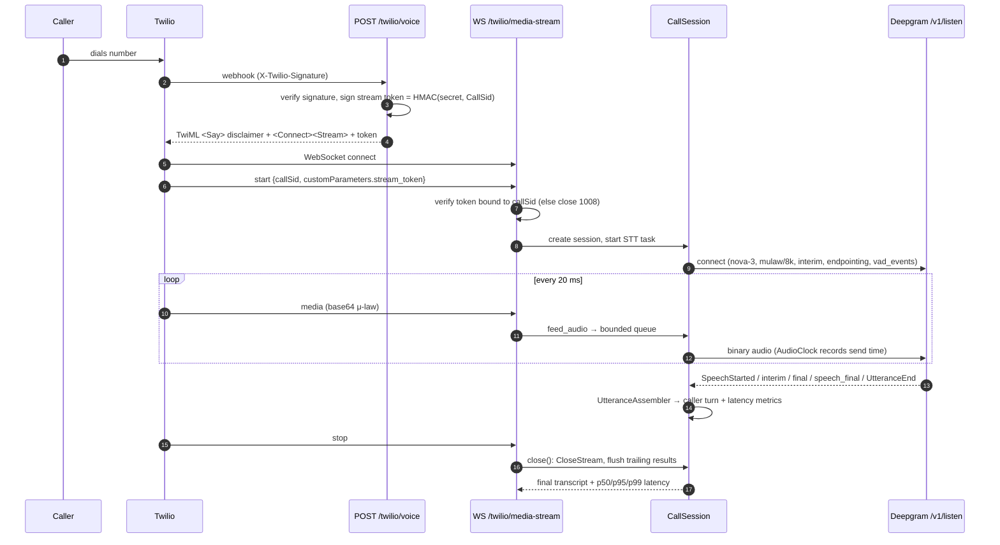
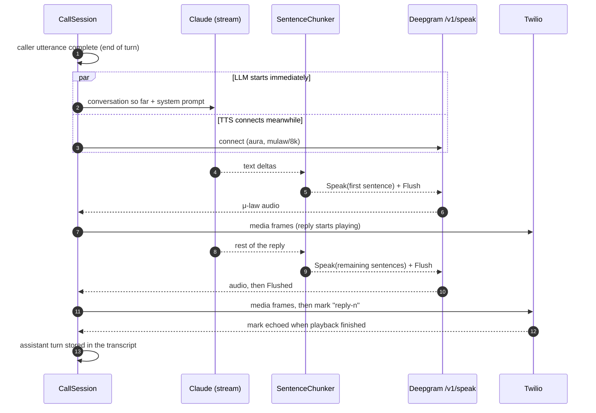
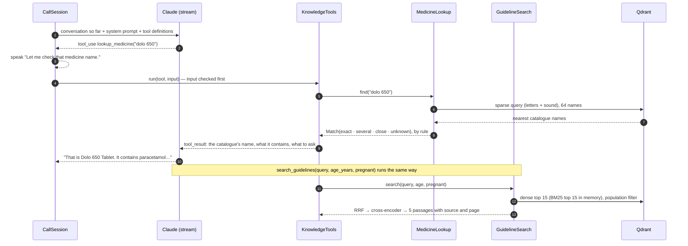
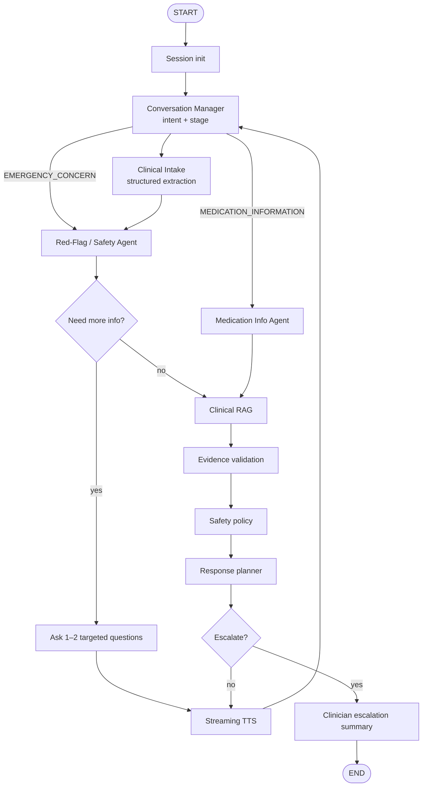
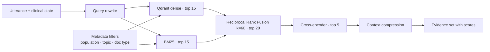
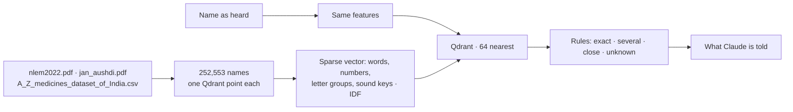

# Clinexa — Architecture

Clinexa is a phone-based primary-care **information** assistant. It listens,
collects a structured history, retrieves WHO evidence, checks medicine names against
the Indian medicines catalogue, screens for red flags, and routes the caller to the
right next step — escalating to a clinician when needed. It never diagnoses,
prescribes, or presents itself as a doctor.

## 1. System overview (target)

```mermaid
flowchart LR
    caller((Caller)) -- PSTN --> twilio[Twilio Voice]
    twilio -- "POST /twilio/voice (signed)" --> api
    twilio <-- "WSS Media Stream<br/>μ-law 8 kHz, 20 ms frames" --> api

    subgraph api[FastAPI · apps/api]
        ws[Media Stream handler] --> session[CallSession]
        session <--> stt[STTProvider<br/>Deepgram streaming]
        session --> graph["LangGraph<br/>agent state machine<br/>(today: one Claude call<br/>with two lookup tools)"]
        graph --> policy[Response policy]
        policy --> tts[TTSProvider<br/>streaming]
        tts --> ws
        graph --> tools[Typed tools]
    end

    tools --> rag[Hybrid RAG<br/>Qdrant + BM25 → RRF → cross-encoder]
    tools --> meds[Medicine name lookup<br/>Qdrant sparse: spelling + sound]
    tools --> pg[(PostgreSQL)]
    session <--> redis[(Redis<br/>live call state)]
    rag --> kb[(WHO knowledge base)]
    meds --> cat[(Indian medicines catalogue<br/>NLEM 2022 · Jan Aushadhi · A to Z)]
    api -. traces .-> obs[Logfire · OpenTelemetry]
    dash[Next.js dashboard] --> api
```

The LLM never touches PostgreSQL or Qdrant directly: every side effect goes
through a typed tool with a timeout, retry policy and structured output.

## 2. Phase 1 — telephony and streaming STT (implemented)



### Design decisions

| Decision | Why |
|---|---|
| **Raw Deepgram WebSocket** instead of SDK | Full control over lifecycle, KeepAlive, CloseStream flush and the VAD events barge-in needs; no coupling to SDK major-version churn. |
| **`STTProvider` / `TTSProvider` ABCs** | The call pipeline depends only on `transcribe_stream(audio, fmt) -> AsyncIterator[TranscriptEvent]`; vendors are swappable. |
| **STT in its own task, fed by a bounded queue** | The WS read loop never blocks on the provider. The queue holds audio across STT reconnects and drops frames rather than growing without bound. |
| **Reconnect with backoff** | A transient Deepgram failure mid-call reconnects without losing queued audio; after N failures the call is marked `stt_unavailable`. |
| **Per-call HMAC stream token** | The WebSocket is only accepted if it carries a token minted by the signature-verified webhook for that exact `CallSid`. |
| **Shielded `close()`** | Client disconnects/shutdown cancel the handler, but finalization (STT flush, metrics, summary) still completes. |
| **`AudioClock`** | Deepgram timestamps are in audio time; mapping them to the wall-clock time each frame was sent yields *real* STT latency. |
| **Masked caller ID, transcript logging off by default** | Transcripts are health information; only masked numbers leave the webhook. |

### Latency metrics recorded per call

| Metric | Definition |
|---|---|
| `stt_finalization_ms` | Wall time from sending the last audio covered by a final result to receiving it. |
| `stt_endpoint_ms` | Wall time from sending the caller's last word to the end-of-turn signal (`speech_final` / `UtteranceEnd`). This includes the endpointing silence window and is the STT share of perceived response delay. |

Each is summarised as count / mean / p50 / p95 / p99 / max (`GET /api/calls/{call_sid}`).

## 3. Phase 2 — spoken replies (implemented)



| Decision | Why |
|---|---|
| **LLM task separate from the TTS stream** | Opening the TTS socket takes most of a second; the model generates during that time instead of after it. |
| **Sentence-level TTS, first sentence flushed alone** | Speech starts after one sentence instead of the whole reply. Later sentences are flushed together because Deepgram rate-limits `Flush`. |
| **μ-law 8 kHz requested from the TTS provider** | Twilio's native format: no resampling or transcoding in the call path. |
| **Fixed fallback line on any LLM failure** | Error, timeout, refusal or empty output never leaves a caller in silence, and the line points them to a clinician or emergency care. |
| **Transcript stores only what was heard** | An assistant turn is recorded once its audio has started, at the position where it was spoken, and flagged `interrupted` if cut off. |
| **Sequential turns** | A caller who speaks during a reply gets one further reply covering everything said since. Barge-in (cancel + Twilio `clear`) is Phase 3. |
| **`ReplyGenerator` interface** | The session depends only on `stream_reply(history, trace) -> AsyncIterator[str]`; the LangGraph graph (Phase 4) slots in behind it. |

| Metric | Definition |
|---|---|
| `llm_ttft_ms` | Reply requested → first text from the model. |
| `llm_first_sentence_ms` | Reply requested → first complete sentence. |
| `llm_total_ms` | Reply requested → full reply text. |
| `tts_ttfa_ms` | First sentence ready → first audio from TTS (includes whatever remains of the TTS connect). |
| `response_latency_ms` | End of turn detected → first reply audio sent to Twilio. |
| `voice_to_voice_ms` | Caller's last word → first reply audio sent to Twilio (`stt_endpoint_ms` + `response_latency_ms`). |

Lookup timings are in section 4. Later phases add agent timings.

## 4. Lookups during a call (implemented)

Claude answers with two tools (`app/tools/knowledge.py`). It decides when to call them;
each call is one more round with the model inside the same reply.



| Decision | Why |
|---|---|
| **The catalogue's answer, not the model's memory** | A medicine name is what speech recognition gets wrong most, and many names sound alike. The system prompt has Claude look every name up before saying anything about it. |
| **Rules decide the match, not a model** (`app/medicines/lookup.py`) | A name is only changed to one it could have been misheard from (a letter out, or the same consonants), and a guess brings no strength or composition with it. Measured on the whole catalogue: `docs/rag.md`. |
| **Age and pregnancy go with every guidance search** | The corpus is about 45% paediatric. Population is a hard filter, so a child is never answered from adult guidance. Claude asks the age before it searches. |
| **A spoken line while a lookup runs** | A lookup adds a second model round. If the reply has said nothing yet, the caller hears "Let me check that…" instead of silence. |
| **A lookup never raises** | Timeout, Qdrant down, index missing, bad input: each comes back to Claude as a `tool_result` with `is_error`, worded so it tells the caller and does not guess. |
| **Models load in the background at start-up** | The bi-encoder, cross-encoder and BM25 index take about 20 s. Until they are in, a search answers "not available" rather than making a caller wait. |
| **A cap on lookups per reply** (`LLM_MAX_TOOL_ROUNDS`, 3) | After the last one the request is sent with `tool_choice: none`, so the model has to answer with what it has. |
| **Stateless across turns** | Each reply rebuilds the conversation from what was spoken. Tool exchanges live only inside the reply that made them, so no earlier turn is ever edited. |
| **No doses read out** | Guidance passages carry doses for health workers. The prompt lets Claude name the medicine guidance recommends, and leaves the dose to a clinician or pharmacist. |

| Metric | Definition |
|---|---|
| `lookup_medicine_ms` | One catalogue lookup, as the tool ran it. |
| `search_guidelines_ms` | One guidance search: embed, dense + BM25, RRF, cross-encoder. |

`GET /api/calls/{call_sid}` also returns `lookups` (tool, outcome, duration) and
`evidence` (document, section, page and excerpt of each passage a reply drew on).
What the caller asked for is never logged: only the tool and how it went.

### Tracing

With `LOGFIRE_TOKEN` set, the same steps are traced to Pydantic Logfire over
OpenTelemetry (`app/observability/tracing.py`). The code is instrumented with the
OpenTelemetry API only, so the spans are no-ops until Logfire is configured as the
provider, and another backend could take its place.

| Span | From | Attributes |
|---|---|---|
| `/twilio/media-stream`, `POST /twilio/voice`, ... | FastAPI instrumentation | method, route, status. No headers, bodies or endpoint arguments |
| `reply` | `CallSession._reply_loop` | `call_sid`, `sentences`, `lookups`, `fallback`, `audio_started` |
| `llm round` | `ClaudeReplyGenerator.stream_reply` | `model`, `round`, `stop_reason`, token counts |
| `tool <name>` | `KnowledgeTools.run` | `tool`, `ok`, `detail` |
| `medicines lookup` | `MedicineLookup.find` | `status` |
| `guidelines search` | `GuidelineSearch.search` | `passages`, `population`, `filter_relaxed`, stage timings |

| Decision | Why |
|---|---|
| **No caller content in any span** | Transcripts, tool arguments and medicine names are health information, and a tracing service is somebody else's server. The rule is the one the logs follow, and a test searches every exported span for it. |
| **Endpoints with a secret in their address are not traced** | The Exotel callbacks carry a key and the web stream a session token in the query string, which request tracing would record. |
| **The Claude request's span is never made current** | The reply is an async generator that yields while the request is open, and can be closed from another task. A span it had made current could not be put back. |

## 5. Agent graph (Phase 4+)



The graph state is `app.graph.state.VoiceClinicalState`; the shared contracts
(`ClinicalIntake`, `SafetyAssessment`, `Evidence`, `EscalationSummary`, …) live in
`app.schemas.clinical`. `SafetyAssessment` enforces a fail-safe invariant in the
schema itself: `urgent`/`emergency` always sets `escalation_required`.

## 6. RAG pipeline (Phases 5–8)



In a call today (`app/rag/retrieval/service.py`): the query is Claude's own wording
(no separate rewrite step), the filter is population only, and compression is not
applied. Topic filters, query rewriting and compression are built and tested, and
wait for the LangGraph agents.

### Medicines catalogue



No chunking and, by default, no model: a name is found by how it is spelt and how it
sounds. A bi-encoder leg and a cross-encoder tie-break exist behind
`MEDICINES_ENCODERS`; they are off because they did not change which medicine is
found. Numbers and the reasoning are in [`rag.md`](rag.md).
