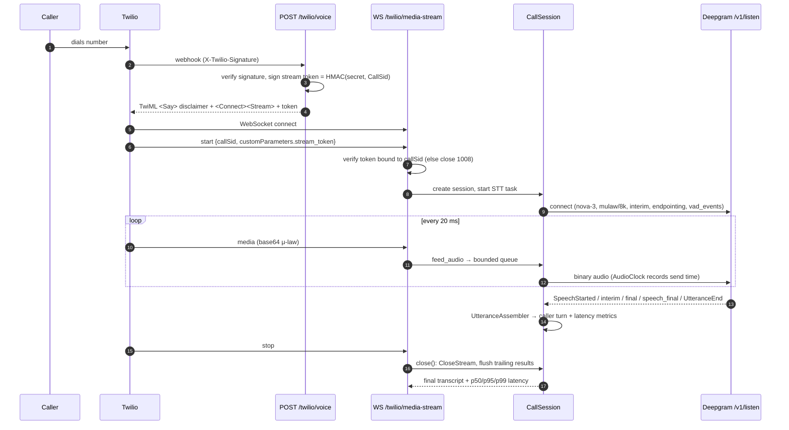
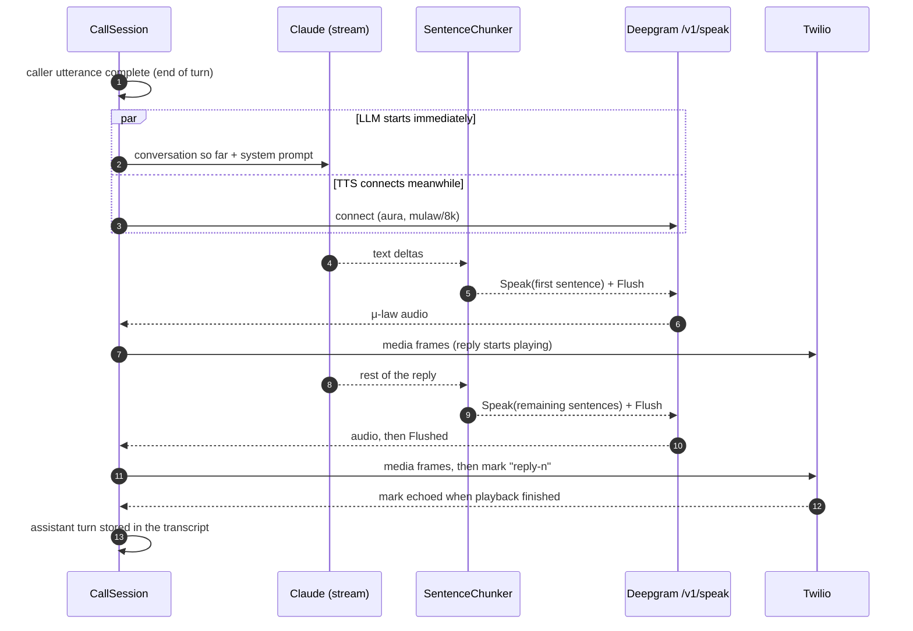
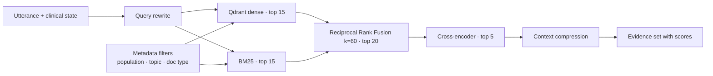

# Clinexa — Architecture

Clinexa is a phone-based primary-care **information** assistant. It listens,
collects a structured history, retrieves WHO evidence, screens for red flags, and
routes the caller to the right next step — escalating to a clinician when needed.
It never diagnoses, prescribes, or presents itself as a doctor.

## 1. System overview (target)

```mermaid
flowchart LR
    caller((Caller)) -- PSTN --> twilio[Twilio Voice]
    twilio -- "POST /twilio/voice (signed)" --> api
    twilio <-- "WSS Media Stream<br/>μ-law 8 kHz, 20 ms frames" --> api

    subgraph api[FastAPI · apps/api]
        ws[Media Stream handler] --> session[CallSession]
        session <--> stt[STTProvider<br/>Deepgram streaming]
        session --> graph["LangGraph<br/>agent state machine<br/>(Phase 2: one Claude call)"]
        graph --> policy[Response policy]
        policy --> tts[TTSProvider<br/>streaming]
        tts --> ws
        graph --> tools[Typed tools]
    end

    tools --> rag[Hybrid RAG<br/>Qdrant + BM25 → RRF → cross-encoder]
    tools --> pg[(PostgreSQL)]
    session <--> redis[(Redis<br/>live call state)]
    rag --> kb[(WHO knowledge base)]
    api -. traces .-> obs[Logfire · OpenTelemetry]
    dash[Next.js dashboard] --> api
```

The LLM never touches PostgreSQL or Qdrant directly: every side effect goes
through a typed tool with a timeout, retry policy and structured output.

## 2. Phase 1 — telephony and streaming STT (implemented)



### Design decisions

| Decision | Why |
|---|---|
| **Raw Deepgram WebSocket** instead of SDK | Full control over lifecycle, KeepAlive, CloseStream flush and the VAD events barge-in needs; no coupling to SDK major-version churn. |
| **`STTProvider` / `TTSProvider` ABCs** | The call pipeline depends only on `transcribe_stream(audio, fmt) -> AsyncIterator[TranscriptEvent]`; vendors are swappable. |
| **STT in its own task, fed by a bounded queue** | The WS read loop never blocks on the provider. The queue holds audio across STT reconnects and drops frames rather than growing without bound. |
| **Reconnect with backoff** | A transient Deepgram failure mid-call reconnects without losing queued audio; after N failures the call is marked `stt_unavailable`. |
| **Per-call HMAC stream token** | The WebSocket is only accepted if it carries a token minted by the signature-verified webhook for that exact `CallSid`. |
| **Shielded `close()`** | Client disconnects/shutdown cancel the handler, but finalization (STT flush, metrics, summary) still completes. |
| **`AudioClock`** | Deepgram timestamps are in audio time; mapping them to the wall-clock time each frame was sent yields *real* STT latency. |
| **Masked caller ID, transcript logging off by default** | Transcripts are health information; only masked numbers leave the webhook. |

### Latency metrics recorded per call

| Metric | Definition |
|---|---|
| `stt_finalization_ms` | Wall time from sending the last audio covered by a final result to receiving it. |
| `stt_endpoint_ms` | Wall time from sending the caller's last word to the end-of-turn signal (`speech_final` / `UtteranceEnd`). This includes the endpointing silence window and is the STT share of perceived response delay. |

Each is summarised as count / mean / p50 / p95 / p99 / max (`GET /api/calls/{call_sid}`).

## 3. Phase 2 — spoken replies (implemented)



| Decision | Why |
|---|---|
| **LLM task separate from the TTS stream** | Opening the TTS socket takes most of a second; the model generates during that time instead of after it. |
| **Sentence-level TTS, first sentence flushed alone** | Speech starts after one sentence instead of the whole reply. Later sentences are flushed together because Deepgram rate-limits `Flush`. |
| **μ-law 8 kHz requested from the TTS provider** | Twilio's native format: no resampling or transcoding in the call path. |
| **Fixed fallback line on any LLM failure** | Error, timeout, refusal or empty output never leaves a caller in silence, and the line points them to a clinician or emergency care. |
| **Transcript stores only what was heard** | An assistant turn is recorded once its audio has started, at the position where it was spoken, and flagged `interrupted` if cut off. |
| **Sequential turns** | A caller who speaks during a reply gets one further reply covering everything said since. Barge-in (cancel + Twilio `clear`) is Phase 3. |
| **`ReplyGenerator` interface** | The session depends only on `stream_reply(history) -> AsyncIterator[str]`; the LangGraph graph (Phase 4) slots in behind it. |

| Metric | Definition |
|---|---|
| `llm_ttft_ms` | Reply requested → first text from the model. |
| `llm_first_sentence_ms` | Reply requested → first complete sentence. |
| `llm_total_ms` | Reply requested → full reply text. |
| `tts_ttfa_ms` | First sentence ready → first audio from TTS (includes whatever remains of the TTS connect). |
| `response_latency_ms` | End of turn detected → first reply audio sent to Twilio. |
| `voice_to_voice_ms` | Caller's last word → first reply audio sent to Twilio (`stt_endpoint_ms` + `response_latency_ms`). |

Later phases add agent, retrieval, reranker and tool timings.

## 4. Agent graph (Phase 4+)


The graph state is `app.graph.state.VoiceClinicalState`; the shared contracts
(`ClinicalIntake`, `SafetyAssessment`, `Evidence`, `EscalationSummary`, …) live in
`app.schemas.clinical`. `SafetyAssessment` enforces a fail-safe invariant in the
schema itself: `urgent`/`emergency` always sets `escalation_required`.

## 5. RAG pipeline (Phases 5–8)


